<!---
 Copyright (c) 2017 Tara Keeling
 
 This software is released under the MIT License.
 https://opensource.org/licenses/MIT
-->

# SSD1306 Component for the ESP32 and ESP-IDF SDK

## About:  
This is a simple component for the SSD1306 display.  
It supports multiple display sizes on both i2c and spi interfaces.  
  
Check out the wiki where most of the relevant information is.

***Examples:*** https://github.com/TaraHoleInIt/tarablessd1306_examples

# **Fork Summary and Additional Comments**  

Updated the `tarablessd1306` component to improve compatibility with current ESP-IDF APIs V6 (July 2026).

**Main changes**
- Replaced the legacy `driver/i2c_master.h` usage with the current `driver/i2c.h` API in default_if_i2c.c.
- Added I2C bus initialization using `i2c_param_config` and `i2c_driver_install`.
- Implemented I2C write routines for SSD1306 commands and data.
- Added a helper to check whether the display is connected on the I2C bus.
- Integrated the default interface into the existing SSD1306 initialization flow.

**Goal**  
Keep the component working on newer ESP-IDF versions while reducing reliance on deprecated APIs and preserving compatibility with current projects.

**Validation**
- Workspace diagnostics were checked and no errors were reported.
- Examples run with minor changes.

# The project, as it is, supports programming an ESP32-C6 Super Mini, where the SDA and SCL pins are GPIO1 and GPIO2, respectively. The following procedure explains how to change the pins assigned to SDA and SCL.

## 🔧 How to change SDA and SCL pins in ESP-IDF
In ESP-IDF projects, the default pin assignments for I²C (SDA and SCL) are stored in the sdkconfig file. This file is automatically generated and updated when you configure your project with idf.py menuconfig.

### Steps to modify SDA and SCL pins:
    1. Open a terminal in your project folder.
    2. Run:
       bash
       idf.py menuconfig
    3. Navigate through the menu:
        ◦ Component config → Driver configurations → I2C configuration
    4. Inside this section, you will find options to set:
        ◦ SDA GPIO number
        ◦ SCL GPIO number
    5. Change the values to the GPIO pins you want to use.
    6. Save and exit (S key).
    7. Rebuild your project:
       bash
       idf.py build
The new pin assignments will be written into the sdkconfig file and applied automatically during compilation.

---

### ⚠️ Special characters showing as `°`, `ª`, `º`

When displaying special characters like `°`, `ª`, and `º` on the ESP32 screen, they may incorrectly appear with a preceding `Â` (for example: `°` instead of `°`).

#### Cause
The source file (`main.c`) is saved in **UTF-8 encoding**. In UTF-8, these characters are encoded as **two bytes** each:
- `°` → `0xC2 0xB0`  
- `ª` → `0xC2 0xAA`  
- `º` → `0xC2 0xBA`  

However, the font file used (`ssd1306_font.h`) is indexed by **single-byte values** (Latin-1/CP1252 style). Since there is no UTF-8 decoding, the renderer interprets each byte separately:
- The first byte `0xC2` maps to the glyph `Â`.  
- The second byte maps to the intended special character.  

This explains why `Â` always appears before the desired symbol.

#### Fix
Replace UTF-8 literal characters with **single-byte escape sequences**. This ensures only one byte is emitted per character:

```c
printf("Hello!\xB0\xAA\xBA");
```

| Character | Escape | Hex Value |
| --- | --- | --- |
| ``¡`` | ``\\xA1`` | 0xA1 |
| ``¢`` | ``\\xA2`` | 0xA2 |
| ``£`` | ``\\xA3`` | 0xA3 |
| ``¤`` | ``\\xA4`` | 0xA4 |
| ``¥`` | ``\\xA5`` | 0xA5 |
| ``¦`` | ``\\xA6`` | 0xA6 |
| ``§`` | ``\\xA7`` | 0xA7 |
| ``¨`` | ``\\xA8`` | 0xA8 |
| ``©`` | ``\\xA9`` | 0xA9 |
| ``ª`` | ``\\xAA`` | 0xAA |
| ``«`` | ``\\xAB`` | 0xAB |
| ``¬`` | ``\\xAC`` | 0xAC |
| ``­`` (soft hyphen) | ``\\xAD`` | 0xAD |
| ``®`` | ``\\xAE`` | 0xAE |
| ``¯`` | ``\\xAF`` | 0xAF |
| ``°`` | ``\\xB0`` | 0xB0 |
| ``±`` | ``\\xB1`` | 0xB1 |
| ``²`` | ``\\xB2`` | 0xB2 |
| ``³`` | ``\\xB3`` | 0xB3 |
| ``´`` | ``\\xB4`` | 0xB4 |
| ``µ`` | ``\\xB5`` | 0xB5 |
| ``¶`` | ``\\xB6`` | 0xB6 |
| ``·`` | ``\\xB7`` | 0xB7 |
| ``¸`` | ``\\xB8`` | 0xB8 |
| ``¹`` | ``\\xB9`` | 0xB9 |
| ``º`` | ``\\xBA`` | 0xBA |
| ``»`` | ``\\xBB`` | 0xBB |
| ``¼`` | ``\\xBC`` | 0xBC |
| ``½`` | ``\\xBD`` | 0xBD |
| ``¾`` | ``\\xBE`` | 0xBE |
| ``¿`` | ``\\xBF`` | 0xBF |

This eliminates the extra `0xC2` byte and the display will show the correct characters without the unwanted `Â`.

---

# Renderized Fonts

## Tarable 7-Seg
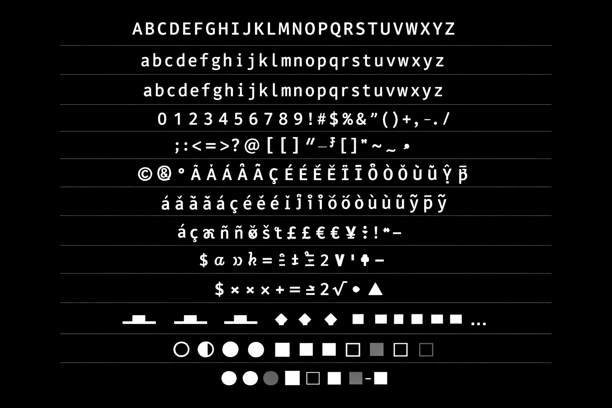
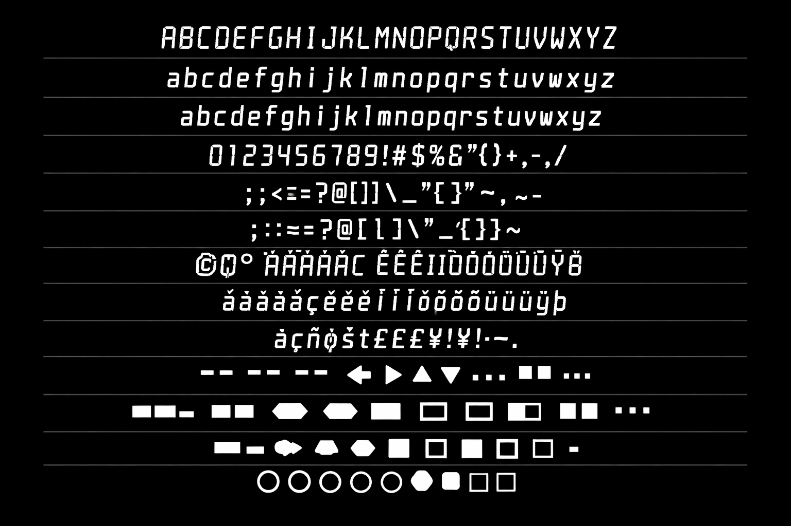

## Liberation Mono
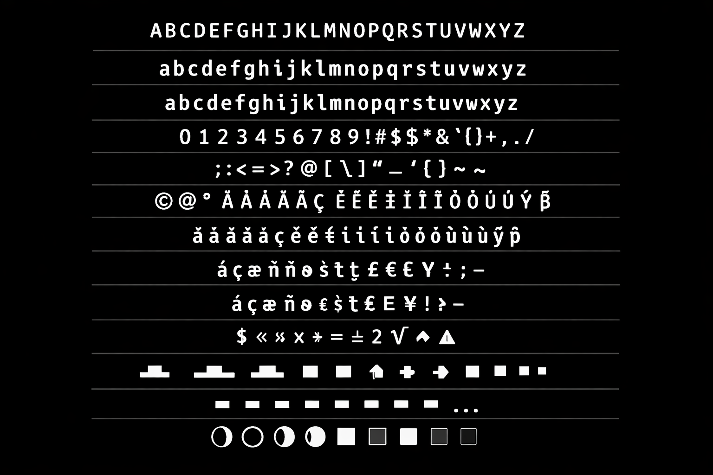
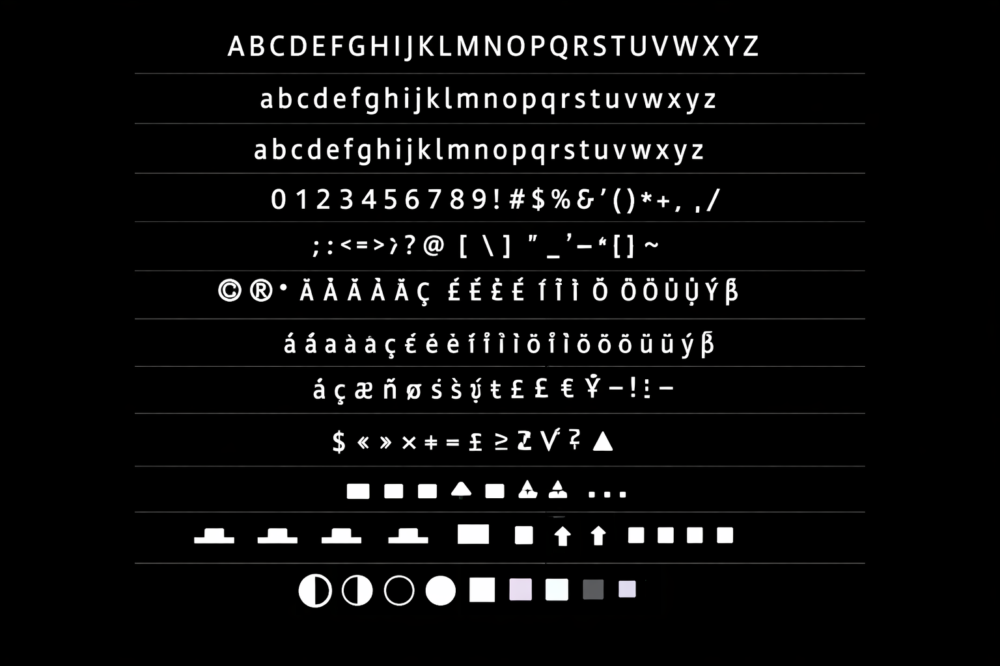
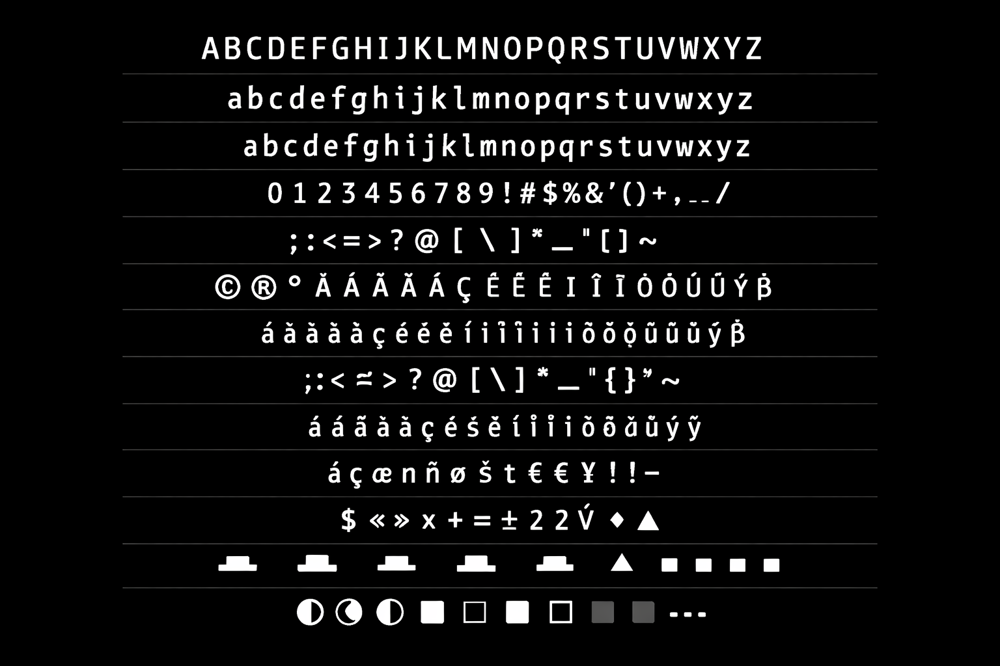

## Droid Sans Mono
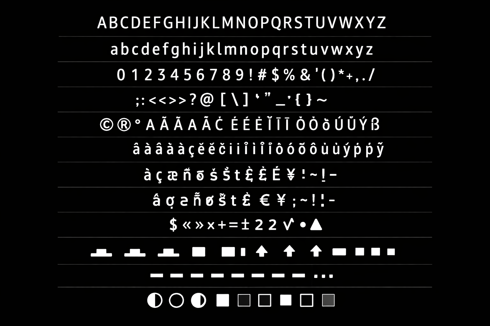
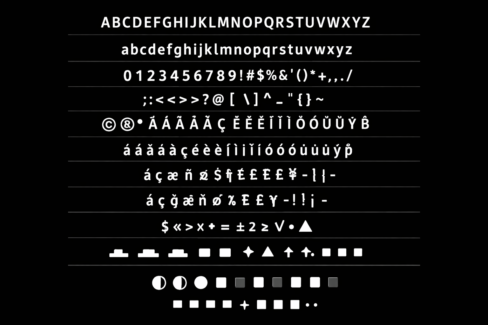
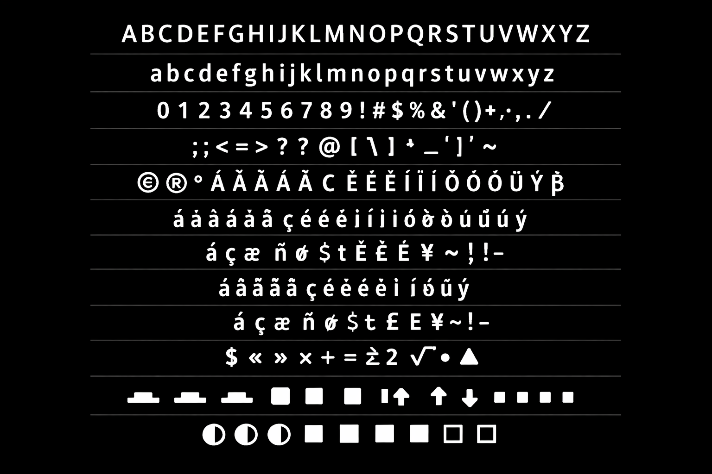

## Droid Sans Fallback
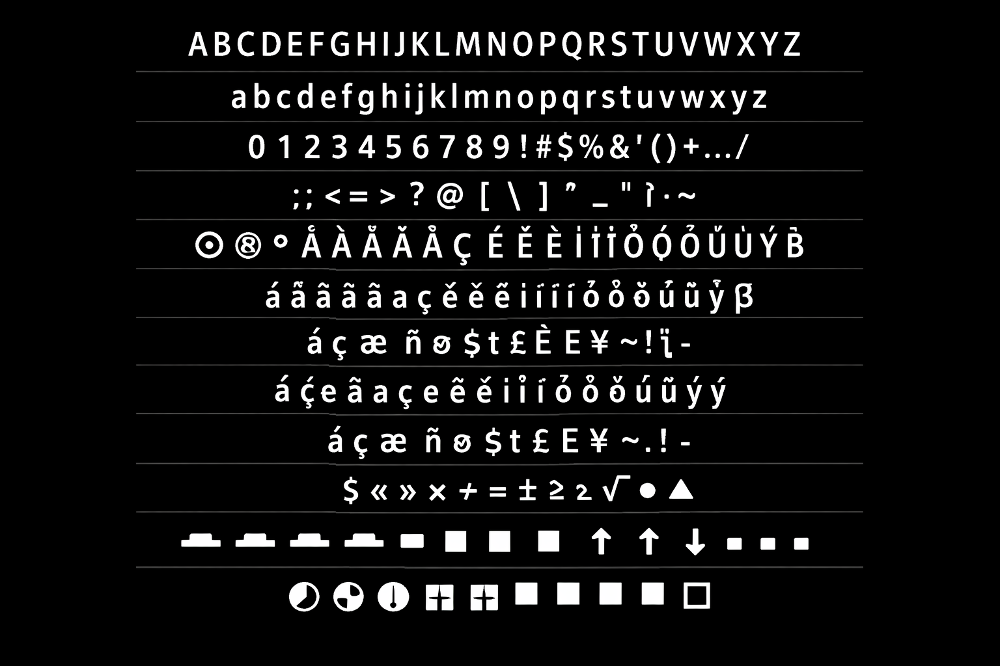
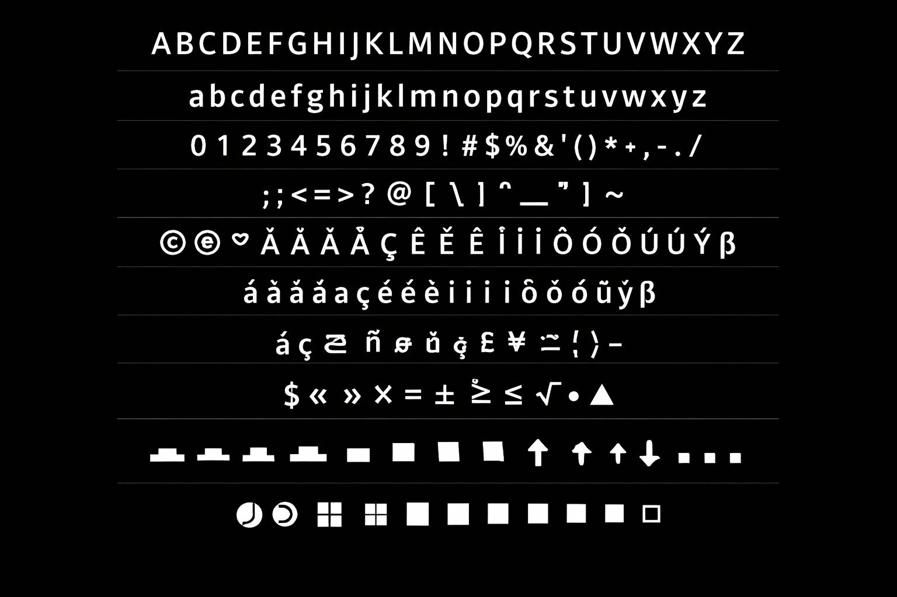
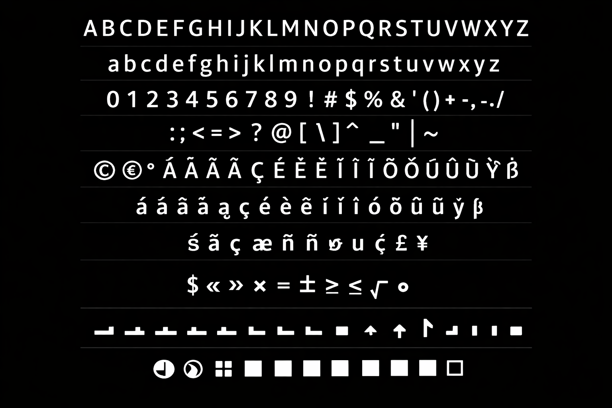


